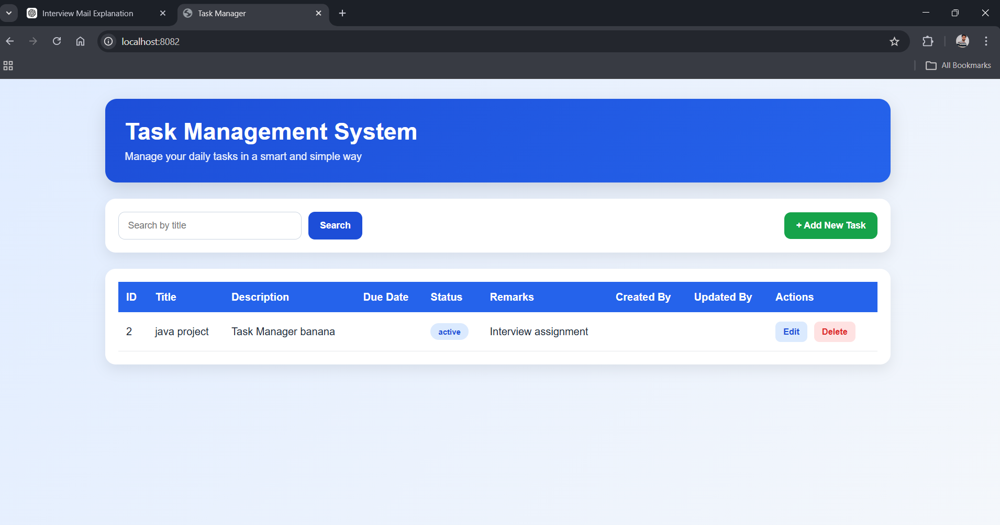
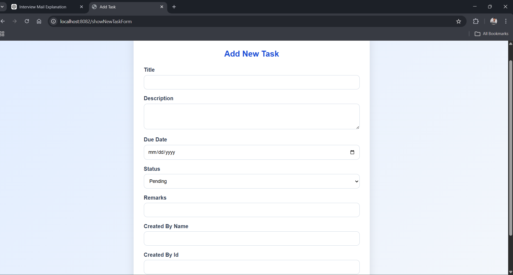
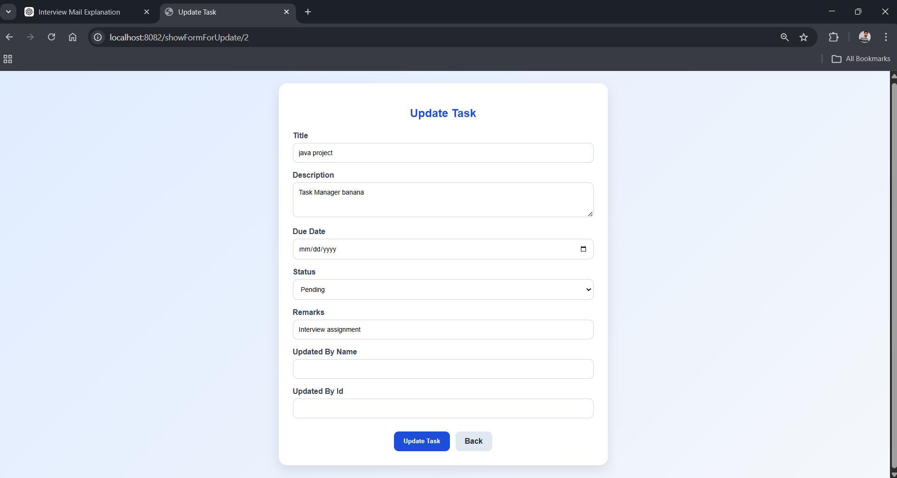

# task-management-system
# Task Management System

## Overview

This project is a Task Management System developed using Java Spring Boot, Thymeleaf and MySQL.

Users can manage tasks using the following operations:

Create Task  
Read Task  
Update Task  
Delete Task  
Search Task

---

## Technologies Used

Backend
Java  
Spring Boot  
Spring Data JPA  

Frontend
HTML  
CSS  
Thymeleaf  

Database
MySQL  

Tools
Eclipse IDE  
GitHub  
Maven  

---

## Application Architecture

This project follows MVC architecture.

Model  
Entity classes representing database tables.

View  
HTML pages using Thymeleaf templates.

Controller  
Handles HTTP requests and business logic.

---

## Features

Create task  
View tasks  
Update task  
Delete task  
Search tasks  

---

## Database Structure

Table Name: tasks

Columns:

id  
title  
description  
due_date  
status  
remarks  
created_by  
updated_by  
created_on  
updated_on  

---

## Home Page

The home page displays all tasks with search functionality.

---

## Add Task Page

Users can create new tasks using this form.

---

## Update Task Page

Users can update task details.

---

## Environment Setup

Required Software:

Java JDK 17+  
MySQL  
Eclipse IDE  

---

## Database Setup

Create database:

CREATE DATABASE taskdb;

---

## Run Project

Run:

TaskmanagerApplication.java

Then open:

http://localhost:8082

---

## How to Run the Project

1. Clone the repository

git clone https://github.com/arun5252/task-management-system.git

2. Open the project in Eclipse or IntelliJ

3. Configure MySQL database in application.properties

4. Run the Spring Boot application

5. Open browser and go to:

http://localhost:8082

## Author

Arun Sharma  
B.Tech Computer Science Engineering
